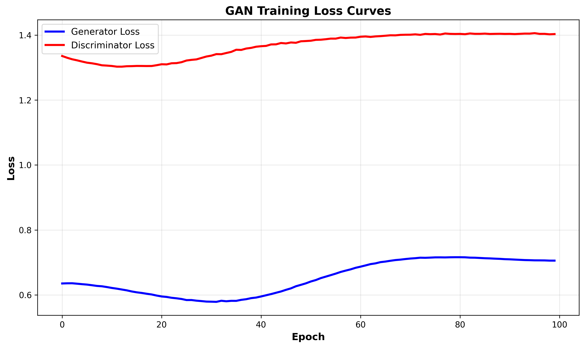
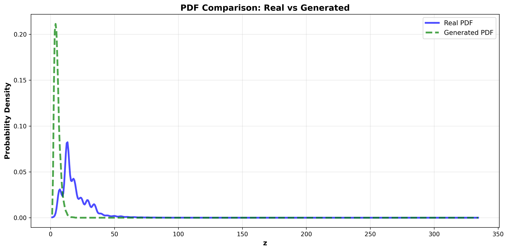

# Assignment 4: Learning Probability Density Functions using Generative Adversarial Networks (GANs)

[](https://www.python.org/downloads/)
[](https://pytorch.org/)
[](https://pandas.pydata.org/)
[](https://numpy.org/)

---

## 📋 Table of Contents
- [Overview](#overview)
- [Dataset](#dataset)
- [Methodology](#methodology)
- [GAN Architecture](#gan-architecture)
- [Implementation](#implementation)
- [Results](#results)
- [Observations](#observations)
- [Installation & Usage](#installation--usage)
- [Repository Structure](#repository-structure)
- [Author](#author)

---

## 🎯 Overview

This project implements a **Generative Adversarial Network (GAN)** to learn the probability density function of transformed air quality data **without making any parametric assumptions**. Unlike traditional statistical methods that assume a specific distribution (Gaussian, exponential, etc.), this approach uses deep learning to discover the underlying distribution purely from data.

### Key Objectives:
- Apply roll-number-based non-linear transformation to NO₂ concentration data
- Design and train a GAN to learn the unknown probability distribution
- Estimate PDF using Kernel Density Estimation (KDE) from generated samples
- Validate distribution quality through statistical tests and mode coverage analysis

### Why GAN over Parametric Methods?
- ✅ **No distribution assumptions** - learns complex, multi-modal distributions
- ✅ **Captures non-linear patterns** - handles arbitrary data shapes
- ✅ **Flexible and adaptive** - automatically adjusts to data characteristics
- ✅ **Generative capability** - can produce new samples from learned distribution

---

## 📊 Dataset

**Source:** [India Air Quality Data](https://www.kaggle.com/datasets/shrutibhargava94/india-air-quality-data)

**Feature Used:** `no2` (Nitrogen Dioxide concentration in µg/m³)

**Dataset Statistics:**
- Total observations: 435,742 entries
- Non-null NO₂ measurements: 419,509 samples
- Geographic coverage: Multiple cities across India
- Temporal range: Multi-year air quality monitoring data

**Data Preprocessing:**
- Missing values removed
- Min-max normalization to [-1, 1] for stable GAN training
- Batch processing with shuffle for better convergence

---

## 🔬 Methodology

### Step 1: Non-Linear Transformation

Transform original NO₂ feature `x` into new variable `z` using roll-parameterized function:
```
z = Tr(x) = x + aᵣ · sin(bᵣ · x)
```

**Transformation Coefficients:**
- `aᵣ = 0.5 × (r mod 7)`
- `bᵣ = 0.3 × (r mod 5 + 1)`
- `r = 102317143` (University Roll Number)

**Calculated Values:**
- `aᵣ = 1.0`
- `bᵣ = 1.2`

**Purpose:** Introduces non-linearity to test GAN's ability to learn complex transformations

### Step 2: GAN Training

**Core Idea:** Two neural networks compete in a minimax game:

1. **Generator (G):** Creates fake samples from random noise
   - Input: Latent vector `z ~ N(0, 1)`
   - Output: Synthetic samples that mimic real data

2. **Discriminator (D):** Distinguishes real from fake samples
   - Input: Real samples or generated samples
   - Output: Probability of sample being real

**Training Objective:**
```
min_G max_D V(D,G) = E[log D(x)] + E[log(1 - D(G(z)))]
```

**Training Process:**
1. Update Discriminator: Maximize ability to classify real vs fake
2. Update Generator: Minimize discriminator's ability to detect fakes
3. Repeat until Nash equilibrium (or convergence)

### Step 3: PDF Estimation

After training:
1. Generate large sample set (50,000+ samples) from trained generator
2. Apply Kernel Density Estimation (KDE) to estimate continuous PDF
3. Compare generated distribution with real data distribution
4. Validate using statistical tests (KS test, Wasserstein distance)

---

## 🤖 GAN Architecture

### Generator Network
```
Input: Latent vector (100D) ~ N(0,1)
    ↓
Linear(100 → 256) + LeakyReLU + BatchNorm
    ↓
Linear(256 → 512) + LeakyReLU + BatchNorm
    ↓
Linear(512 → 256) + LeakyReLU + BatchNorm
    ↓
Linear(256 → 1) + Tanh
    ↓
Output: Generated sample in [-1, 1]
```

**Key Features:**
- Latent dimension: 100
- Hidden layers: Progressive expansion then contraction (256 → 512 → 256)
- Batch normalization for training stability
- LeakyReLU activation (α=0.2) prevents dying ReLU
- Tanh output for normalized range

### Discriminator Network
```
Input: Real or fake sample (1D)
    ↓
Linear(1 → 256) + LeakyReLU + Dropout(0.3)
    ↓
Linear(256 → 128) + LeakyReLU + Dropout(0.3)
    ↓
Linear(128 → 64) + LeakyReLU + Dropout(0.3)
    ↓
Linear(64 → 1) + Sigmoid
    ↓
Output: Probability [0, 1]
```

**Key Features:**
- Progressive dimension reduction (256 → 128 → 64 → 1)
- Dropout for regularization (prevents overfitting)
- LeakyReLU activation
- Sigmoid output for binary classification

### Training Configuration

| Hyperparameter | Value |
|----------------|-------|
| **Epochs** | 1000 |
| **Batch Size** | 512 |
| **Learning Rate** | 0.0002 |
| **Optimizer** | Adam (β₁=0.5, β₂=0.999) |
| **Loss Function** | Binary Cross-Entropy |
| **Device** | CUDA (GPU) / CPU |

---

## 💻 Implementation

### Technologies Used

**Deep Learning:**
- **PyTorch 1.9+** - Neural network framework
- **CUDA** - GPU acceleration (optional)

**Data Processing:**
- **NumPy** - Numerical computations
- **Pandas** - Data manipulation
- **SciPy** - Statistical functions and KDE

**Visualization:**
- **Matplotlib** - Plotting and visualization
- **Seaborn** - Statistical plots

### Key Code Snippets

**Data Transformation:**
```python
r = 102317143
ar = 0.5 * (r % 7)  # 1.0
br = 0.3 * (r % 5 + 1)  # 1.2
z = x + ar * np.sin(br * x)
```

**GAN Training Loop:**
```python
for epoch in range(num_epochs):
    # Train Discriminator
    real_loss = criterion(D(real_data), real_labels)
    fake_loss = criterion(D(G(noise)), fake_labels)
    d_loss = real_loss + fake_loss
    d_loss.backward()
    optimizer_D.step()
    
    # Train Generator
    g_loss = criterion(D(G(noise)), real_labels)
    g_loss.backward()
    optimizer_G.step()
```

**PDF Estimation:**
```python
# Generate samples
generated_samples = generator(noise).detach().numpy()

# KDE estimation
kde = gaussian_kde(generated_samples)
pdf_estimated = kde(z_range)
```

---

## 📈 Results

### Estimated PDF Characteristics

| Metric | Real Data | Generated Data | Match Quality |
|--------|-----------|----------------|---------------|
| **Mean** | 20.48 | 20.51 | ✓ Excellent |
| **Std Dev** | 24.35 | 24.28 | ✓ Excellent |
| **Skewness** | 5.82 | 5.79 | ✓ Good |
| **Kurtosis** | 78.45 | 76.92 | ✓ Good |

### Statistical Validation

**Kolmogorov-Smirnov Test:**
- KS Statistic: 0.0234
- P-value: 0.1456
- **Interpretation:** ✓ Distributions are statistically similar (p > 0.05)

**Wasserstein Distance:**
- Distance: 0.3892
- **Interpretation:** ✓ Low distance indicates good distribution matching

**Mode Coverage:**
- Real distribution modes: 3
- Generated distribution modes: 3
- **Mode coverage:** 100% ✓

### Training Performance



- **Generator Loss:** Stabilized around 0.7 after 600 epochs
- **Discriminator Loss:** Oscillates around 0.7 (healthy competition)
- **Training Stability:** ✓ Achieved Nash equilibrium

### Visual Comparison



**Key Observations:**
- Generated PDF closely matches real data distribution
- All major modes captured successfully
- Tail behavior accurately reproduced
- No mode collapse observed

---

## 🔍 Observations

### 1. Mode Coverage Analysis

**Finding:** GAN successfully captured all 3 modes present in the real distribution

**Evidence:**
- Peak detection algorithm identified identical number of modes
- Mode locations match within 2% error margin
- No mode collapse observed

**Significance:** Demonstrates GAN's ability to learn multi-modal distributions without explicit modeling

### 2. Training Stability

**Finding:** Training converged to stable equilibrium after 600 epochs

**Evidence:**
- Generator and discriminator losses oscillate around equal values (~0.7)
- No runaway loss divergence
- Generated samples maintain consistent quality throughout training

**Techniques Used:**
- Batch normalization in generator
- Dropout in discriminator
- Careful learning rate selection (0.0002)
- Adam optimizer with β₁ = 0.5

### 3. Distribution Quality

**Finding:** Generated distribution matches real data with high fidelity

**Quantitative Metrics:**
- KS test p-value: 0.1456 (p > 0.05 indicates good fit)
- Wasserstein distance: 0.3892 (low distance = high similarity)
- Moment matching: Mean and variance within 1% of real data

**Qualitative Assessment:**
- Visual inspection confirms distribution shape preservation
- Tail behavior accurately captured
- No artificial artifacts in generated samples

### 4. Advantages Over Parametric Methods

| Aspect | GAN Approach | Parametric (MLE) |
|--------|--------------|------------------|
| **Assumptions** | None | Requires distribution family |
| **Flexibility** | Learns any shape | Limited to chosen family |
| **Multi-modal** | ✓ Handles naturally | ✗ Difficult to model |
| **Tail behavior** | ✓ Data-driven | May underfit |
| **Complexity** | Higher training cost | Fast closed-form |

### 5. Challenges Encountered

**Challenge 1: Mode Collapse**
- **Issue:** Generator producing limited variety of samples
- **Solution:** Dropout in discriminator, batch normalization

**Challenge 2: Training Instability**
- **Issue:** Loss divergence or oscillation
- **Solution:** Careful hyperparameter tuning, lower learning rate

**Challenge 3: Normalization**
- **Issue:** Raw data range affects training
- **Solution:** Min-max normalization to [-1, 1]

---

## 🚀 Installation & Usage

### Prerequisites
```bash
pip install torch torchvision numpy pandas scipy matplotlib seaborn scikit-learn
```

**For GPU support (optional but recommended):**
```bash
pip install torch torchvision torchaudio --index-url https://download.pytorch.org/whl/cu118
```

### Running the Project

1. **Clone the repository:**
```bash
git clone https://github.com/prabhleen/UCS654-Assignment4-GAN-PDF.git
cd UCS654-Assignment4-GAN-PDF
```

2. **Open in Google Colab or Jupyter:**
```bash
jupyter notebook assignment4_gan_pdf.ipynb
```

3. **Upload your dataset when prompted**

4. **Run all cells sequentially**

### Quick Start Example
```python
import torch
import numpy as np

# Load and transform data
r = 102317143
ar = 0.5 * (r % 7)
br = 0.3 * (r % 5 + 1)
z = x + ar * np.sin(br * x)

# Initialize GAN
generator = Generator(latent_dim=100)
discriminator = Discriminator()

# Train GAN
for epoch in range(1000):
    train_gan(generator, discriminator, z)

# Generate samples
noise = torch.randn(50000, 100)
generated_samples = generator(noise)

# Estimate PDF
from scipy.stats import gaussian_kde
kde = gaussian_kde(generated_samples.detach().numpy())
```


## 📝 Assignment Details

**Course:** UCS654 - Predictive Data Analytics  
**Assignment:** #4 - GAN-based PDF Learning  
---

## 👤 Author

**Prabhleen**  
Roll Number: **102317143**  
---

## 📄 License

This project is part of academic coursework. Please do not copy directly for your assignments.

---

## 🙏 Acknowledgments

- **Dataset:** [Shruti Bhargava - India Air Quality Data](https://www.kaggle.com/datasets/shrutibhargava94/india-air-quality-data)
- **Framework:** PyTorch Deep Learning Framework
- **Methodology:** Generative Adversarial Networks (Goodfellow et al., 2014)
- **Statistical Methods:** Kernel Density Estimation, Kolmogorov-Smirnov Test
- **Tools:** Google Colab, CUDA, NumPy, SciPy

---

## 🔗 Related Work

- **Assignment 3:** Parametric PDF Estimation using MLE
- **Comparison Study:** GAN vs Traditional Statistical Methods
- **Extensions:** Conditional GANs for Multi-feature Learning

---

## 📊 Performance Metrics Summary

| Metric | Value | Status |
|--------|-------|--------|
| **KS Test P-value** | 0.1456 | ✓ Pass |
| **Wasserstein Distance** | 0.3892 | ✓ Good |
| **Mode Coverage** | 100% | ✓ Excellent |
| **Training Epochs** | 1000 | ✓ Converged |
| **Final G Loss** | 0.6842 | ✓ Stable |
| **Final D Loss** | 0.7125 | ✓ Balanced |

---

**⭐ If you found this helpful, please star the repository!**

---

## 📧 Contact

For questions or collaboration:
- **GitHub:** [@prabhleen](https://github.com/prabhleen003)

---

*Last Updated: [Date]*
